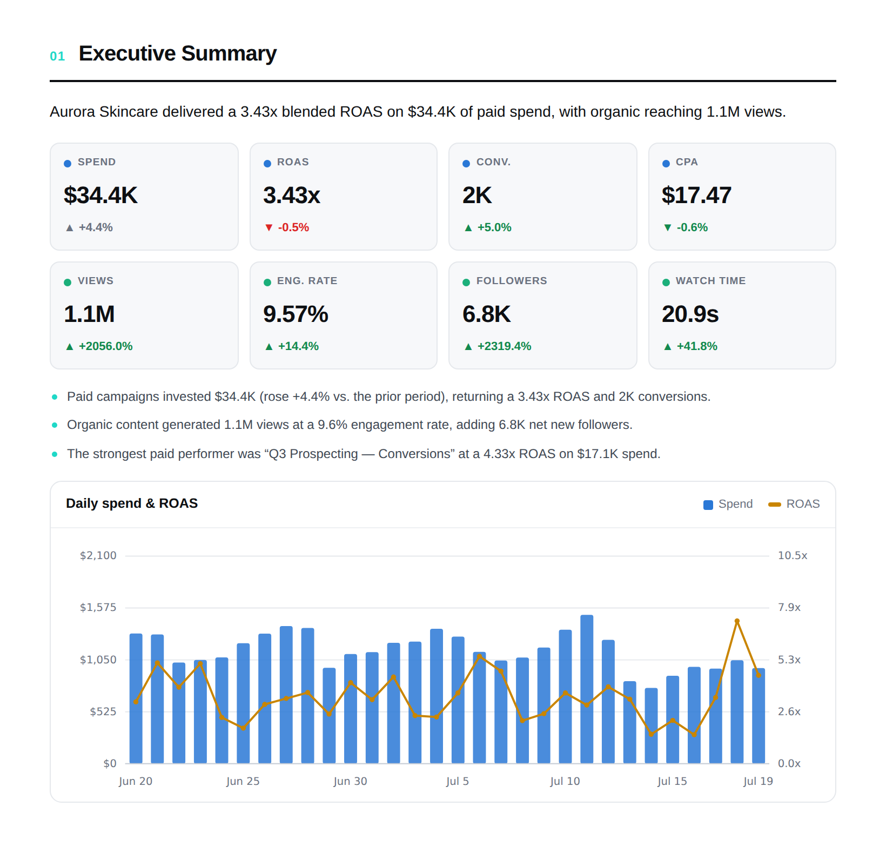

# Phase 1.5 — Client PDF Reports — HANDOVER

> **🪦 Superseded — this describes code that no longer exists.**
> The Brief Deck replaced this report, and M7 deleted its renderer
> (`packages/reports/src/{model,render,insights}.ts`, kill-list row K2).
> `GET /api/reports/:slug` is now a deprecated 308 alias to
> `/api/reports/:slug/brief/:objective`. Kept as the record of what was
> built and why — see [brief-deck/](./brief-deck/README.md) for what
> replaced it.

**Status (as shipped):** ✅ Complete · **Verified:** report renders end-to-end; `/api/reports/:slug`
returns a valid ~210 KB PDF; cover, KPIs, inline SVG charts, tables, and the
auto-generated action plan all render correctly (screenshots in `docs/screenshots/`).



## 1. What shipped

A one-click **"Export report"** button on the dashboard that generates a
polished, client-ready **PDF performance report** for the selected window —
modeled on a real agency TTS weekly report (executive summary → analysis →
tables → prioritized action plan → outlook).

### `@tempo/reports` (new package)
Pure, framework-free report generation:
- `buildReport(db, client, range, { generatedAt })` — assembles a `ReportModel`
  by reusing the exact dashboard rollups, so the report can never disagree with
  the live dashboard.
- `insights.ts` — deterministic narrative + a **prioritized action plan** from
  heuristics over the data (scale winners with ROAS ≥ 3, reallocate laggards
  below 2×, flag rising CPA, amplify high-engagement content, review paused
  campaigns) + an analyst confidence rating.
- `charts.ts` — dependency-free **inline SVG** bar+line combo chart (concrete
  colors, no CSS vars) that renders identically in headless Chromium.
- `render.ts` — `renderReportHtml(model)` produces a single self-contained,
  A4-print-optimized HTML document (inline styles, inline SVG, no network/JS).

### Web app
- `apps/web/src/lib/report-pdf.ts` — `htmlToPdf(html)`: headless Chromium
  (playwright-core) → A4 PDF with page-numbered footer. Chromium is resolved
  from `PLAYWRIGHT_CHROMIUM_PATH` / `PLAYWRIGHT_BROWSERS_PATH`, else Playwright's
  managed browser.
- `apps/web/src/app/api/reports/[slug]/route.ts` — `GET` returns the PDF
  (`?format=html` returns the raw document for fast iteration). Node runtime.
- `ExportReportButton` — fetches the PDF for the current preset and downloads it,
  with loading + error states.

## 2. Report structure (6 sections + cover)

Cover (brand-colored) · 01 Executive Summary (8 KPI tiles + spend/ROAS combo
chart + narrative) · 02 Paid Performance (narrative + campaign table) · 03
Organic Performance (views/engagement chart + top-content table) · 04 Creative &
Content Diagnosis · 05 Risks & Prioritized Action Plan · 06 Outlook & Confidence.

## 3. Notable decisions

- **Server-side PDF, not client print.** A real API-generated PDF (headless
  Chromium) gives a consistent, downloadable artifact — not a browser print
  dialog. `playwright-core` is `serverExternalPackages` so it's never bundled.
- **SVG charts, not Recharts.** The report renders server-side with no React
  runtime, so charts are generated as inline SVG — crisp vectors in the PDF.
- **Language:** English-first, but **all copy is centralized** in `insights.ts`
  and `render.ts` string builders, so a Bahasa Indonesia (or per-client) locale
  is a localization pass, not a rewrite.

## 4. How to run / verify

```bash
pnpm dev            # dashboard → "Export report" downloads the PDF
# or hit the API directly:
curl -o report.pdf "http://localhost:3000/api/reports/aurora-skincare?preset=30d"
curl "http://localhost:3000/api/reports/aurora-skincare?preset=30d&format=html"  # preview
```

For non-standard environments set `PLAYWRIGHT_CHROMIUM_PATH` to a Chromium
binary. `pnpm typecheck · lint · test · build` all pass.

## 5. Deferred / next

- Localization (Bahasa Indonesia default) — the obvious next toggle.
- Custom date ranges, scheduled/emailed reports, agency logo & white-label
  cover, saved report history, per-section include/exclude.
- Word/PPTX export variants if clients want editable deliverables.
