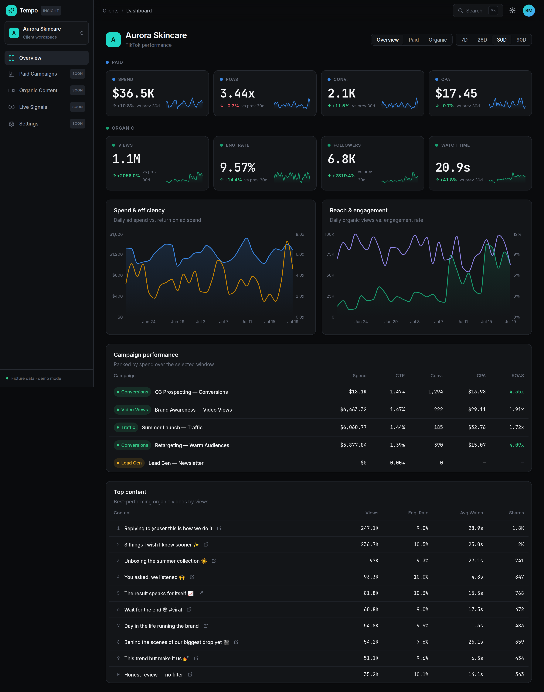

# Phase 1 — Vertical Slice: Client Dashboard — HANDOVER

**Status:** ✅ Complete · **Verified:** full stack runs end-to-end (ingest →
PGlite → tRPC → UI); typecheck/lint/test/build all green; dashboard rendered and
screenshotted in dark + light themes.



## 1. What shipped

A complete, polished, end-to-end slice: **ingest → store → serve → visualize**
for one client, running with zero external services.

### Design system (`@tempo/ui`)
Theme-aware React component library implementing `docs/design`, consumed by the
web app:
- `Button`, `Card`/`CardHeader`/`CardBody`, `Badge`, `SegmentedControl`, `Table`
  kit, `Skeleton`/`StatTileSkeleton`, `EmptyState`.
- `StatTile` — the KPI tile (eyebrow → tabular value → `DeltaPill` → `Sparkline`).
- `DeltaPill` — honest delta indicator (arrow follows the number, color follows
  favorability, so a falling CPA is a green down-arrow).
- `Sparkline` — dependency-free inline SVG.
- A **Tailwind preset** (`tailwind-preset.js`) mapping design tokens → semantic
  classes (`bg-surface`, `text-secondary`, `text-accent`, …).

### API (`apps/web` server — tRPC v11)
- `dashboard.get` → returns the full `DashboardData` read-model (+ recent syncs)
  for a client + preset window.
- `clients.list` → clients for the client switcher.
- Fetch-adapter route at `/api/trpc/*` on the Node runtime; superjson transformer.

### Dashboard UI (`apps/web`)
- **App shell**: fixed `Sidebar` (brand, `ClientSwitcher`, nav), sticky `Topbar`
  (`ThemeToggle`, search affordance), responsive content column.
- **`DashboardView`**: surface toggle (Overview / Paid / Organic) + date-range
  presets (7/28/30/90D) driving live tRPC queries with skeleton + empty states.
- **`KpiGrid`**: two labeled KPI groups — Paid (Spend, ROAS, Conversions, CPA)
  and Organic (Views, Engagement Rate, Followers, Watch Time), each a `StatTile`.
- **Charts** (Recharts, theme-aware via `useChartTheme`): "Spend & efficiency"
  (spend area + ROAS line, dual axis) and "Reach & engagement" (views area +
  engagement line).
- **Tables**: `CampaignTable` (ranked by spend, objective + status badges) and
  `TopVideosTable` (top organic content with TikTok deep links).

### Ingestion CLI (`apps/ingestion`)
- `tempo-ingest` — backfill/sync CLI over the same pipeline the seed uses:
  `--preset`, `--start/--end`, `--bootstrap`, `--today`.

## 2. Notable engineering decisions (and gotchas resolved)

- **`.js` ESM specifiers → webpack**: workspace packages use `.js` import
  specifiers pointing at `.ts`. Next's webpack resolves them via
  `resolve.extensionAlias` in `next.config.mjs`.
- **Native DB drivers stay external**: `serverExternalPackages` doesn't cover
  imports reached *through* a transpiled workspace package, so PGlite/`postgres`
  are pushed to server `externals` explicitly — lets PGlite load its WASM at
  runtime instead of being (mis)bundled.
- **CSS vars in charts**: Recharts writes colors as SVG *presentation
  attributes* where `var(--token)` doesn't resolve — and nested aliases like
  `--viz-series-paid: var(--viz-cat-1)` don't resolve via `getPropertyValue`
  either. `useChartTheme` resolves each token to a concrete `rgb()` off a probe
  element and re-resolves on theme change.
- **Chart entrance animation**: the theme-resolve effect re-renders right after
  mount, which interrupted Recharts' reveal clip-path and left series invisible;
  entrance animation is disabled for reliable static rendering.

## 3. Contracts for the next phase

- **`DashboardData`** (`@tempo/db`) is the API↔UI contract. New widgets read
  from it; new metrics = catalog entry + rollup field + (optionally) a KPI key.
- **`RouterOutputs`/`RouterInputs`** (`apps/web/src/trpc/types.ts`) give the
  client end-to-end inferred types — use these, not hand-written shapes.
- **`@tempo/ui`** components are presentational/controlled — safe to reuse in new
  screens; state and data live with the consumer.
- **`DASHBOARD_ANCHOR_DATE`** anchors demo windows to the seeded data; swap for
  the real current date once live ingestion runs on a schedule.

## 4. How to run / verify

```bash
pnpm install
pnpm db:generate && pnpm db:migrate && pnpm db:seed   # one-time
pnpm dev                                              # http://localhost:3000
# or the whole CI gate:
pnpm typecheck && pnpm lint && pnpm test && pnpm build
```

## 5. Deferred (by design → Phase 2)

- **Auth & multi-tenant enforcement** — schema/context are ready; procedures are
  currently unscoped (`publicProcedure`).
- **OAuth account connection** — `LiveTikTokProvider.listAccounts()` returns `[]`
  until onboarding seeds connected accounts.
- **Scheduled ingestion** — `apps/ingestion` runs on demand; BullMQ/Redis
  scheduling and the "Live Signals" surface are stubbed ("Soon" in the nav).
- **Drill-down routes** — Paid Campaigns / Organic Content detail pages, custom
  date ranges, CSV/PDF export.
- **Server-side prefetch/hydration** — dashboard fetches client-side today;
  RSC prefetch + hydration is a straightforward enhancement.
